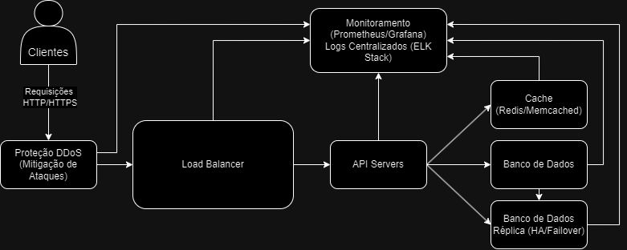

# Arquitetura Escalável de API

## Visão Geral
Este repositório contém o design e a implementação de uma arquitetura escalável e altamente disponível para uma API. A arquitetura foi projetada para lidar com o crescimento exponencial do volume de acessos, garantindo alta performance e tolerância a falhas.

---

## Funcionalidades
- **Load Balancer:** Distribui o tráfego entre várias instâncias da API, evitando sobrecarga em um único servidor.
- **Auto-Scaling:** Ajusta dinamicamente o número de servidores da API com base no volume de tráfego.
- **Cache:** Utiliza Redis/Memcached para reduzir a carga no banco de dados e melhorar os tempos de resposta.
- **Replicação de Banco de Dados:** Garante alta disponibilidade e tolerância a falhas com réplicas distribuídas geograficamente.
- **Monitoramento e Logs:** Implementa Prometheus, Grafana e ELK Stack para monitoramento em tempo real e gerenciamento centralizado de logs.
- **Proteção contra DDoS:** Protege o sistema contra tráfego malicioso com AWS Shield ou soluções semelhantes.
- **Pipeline CI/CD:** Facilita implantações contínuas com ferramentas como GitHub Actions ou Azure DevOps.

---

## Diagrama da Arquitetura

---

## Tecnologias Utilizadas
- **Framework Backend:** Flask (Python) ou Express.js (Node.js)
- **Load Balancer:** AWS ELB ou NGINX
- **Cache:** Redis ou Memcached
- **Banco de Dados:** PostgreSQL com replicação
- **Monitoramento:** Prometheus e Grafana
- **Logs:** ELK Stack (Elasticsearch, Logstash, Kibana)
- **CI/CD:** GitHub Actions ou Azure DevOps

---

